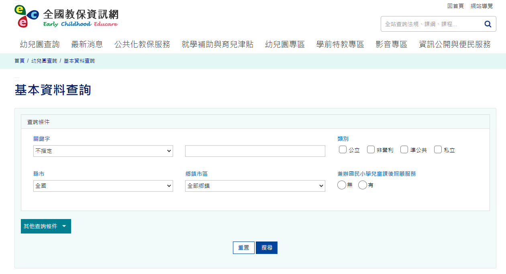
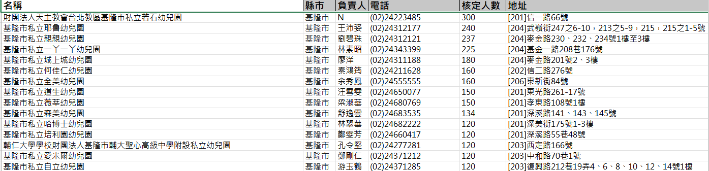

# 全台私立幼兒園名單 Web Crawler - 全國教保資訊網

---
## [URL](https://www.ece.moe.edu.tw/ch/)

In order to grab the list of private kindergartens from the National Education Insurance Information Network, use Selenium, Beatuiful Soup, and Chrome Webdriver to complete. And output is an Excel file.
 
 

 
 
               

## Download
--- 
- [chrome Driver](https://chromedriver.chromium.org/downloads)

Download the latest version of ChromeDriver to avoid incompatibilities with your chrome browser version.

## Requirements
---
- Windows 10
- Python 3.7.13
- Selenium 4.4.0
- Beautifulsoup4 4.11.1
- openpyxl 3.0.10
- pandas 1.3.5
- request 2.28.1

## Output Sample
---
 

